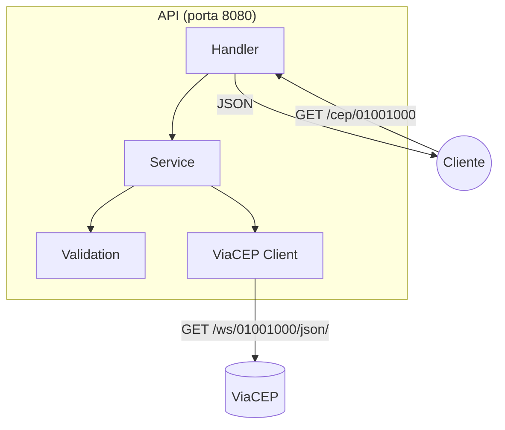

# API CEP

API REST em Go que consulta endereços brasileiros via [ViaCEP](https://viacep.com.br/), mapeando a resposta em uma struct Go e retornando o mesmo contrato JSON.

## Arquitetura



## Requisitos

- Go 1.22+

## Executar a API

### Com ViaCEP real (produção)

```bash
go run ./cmd/server
```

A API sobe em `http://localhost:8080`.

### Com mock local (recomendado para desenvolvimento)

**Terminal 1 — Mock do ViaCEP:**

```bash
go run ./mocks/mockserver
```

O mock sobe em `http://localhost:8081` e serve respostas de `mocks/responses/`.

**Terminal 2 — API apontando para o mock:**

```bash
VIACEP_BASE_URL=http://localhost:8081 go run ./cmd/server
```

**Terminal 3 — Testar:**

```bash
# CEP válido (Praça da Sé, São Paulo)
curl -s http://localhost:8080/cep/01001000 | jq

# CEP inexistente
curl -s http://localhost:8080/cep/99999999 | jq

# CEP inválido
curl -s http://localhost:8080/cep/95010A10 | jq
```

## Contrato da API

### Request

```
GET /cep/{cep}
```

- `{cep}`: 8 dígitos numéricos, sem hífen (ex: `01001000`)

### Response — Sucesso (200)

```json
{
  "cep": "01001-000",
  "logradouro": "Praça da Sé",
  "complemento": "lado ímpar",
  "unidade": "",
  "bairro": "Sé",
  "localidade": "São Paulo",
  "uf": "SP",
  "estado": "São Paulo",
  "regiao": "Sudeste",
  "ibge": "3550308",
  "gia": "1004",
  "ddd": "11",
  "siafi": "7107"
}
```

### Response — Erros

| Status | Cenário |
|--------|---------|
| 400 | CEP com formato inválido |
| 404 | CEP válido mas inexistente |
| 502 | Falha ao consultar o ViaCEP |

## Variáveis de ambiente

| Variável | Padrão | Descrição |
|----------|--------|-----------|
| `PORT` | `8080` | Porta da API |
| `VIACEP_BASE_URL` | `https://viacep.com.br` | URL base do ViaCEP (ou mock) |
| `MOCK_PORT` | `8081` | Porta do mock server |
| `MOCK_RESPONSES_DIR` | `mocks/responses` | Diretório dos JSONs mockados |

## Testes

### Testes unitários

```bash
go test ./... -v
```

### Testes de integração (handler + service + client)

```bash
go test ./internal/handler/... -v -run Integration
```

### Testes end-to-end (API em execução)

Com a API e o mock rodando:

```bash
go test -tags=integration ./test/integration/... -v
```

## Mock — adicionar novos CEPs

Crie um arquivo JSON em `mocks/responses/{cep}.json` com o contrato ViaCEP:

```
mocks/responses/
├── 01001000.json   # CEP válido
└── 99999999.json   # CEP inexistente ({"erro": "true"})
```

CEPs sem arquivo correspondente retornam `{"erro": "true"}` automaticamente.

## Estrutura do projeto

```
api-cep/
├── cmd/server/           # Ponto de entrada da API
├── internal/
│   ├── domain/           # Struct Address e erros de domínio
│   ├── validation/       # Validação de formato do CEP
│   ├── client/           # Client HTTP do ViaCEP
│   ├── service/          # Lógica de negócio
│   └── handler/          # Endpoints HTTP
├── mocks/
│   ├── responses/        # JSONs mockados
│   └── mockserver/       # Servidor mock do ViaCEP
├── test/integration/     # Testes E2E (tag: integration)
├── specs/                # Documentação de decisões
└── changelogs/           # Histórico de mudanças
```

## Documentação adicional

- Decisões de arquitetura: [`specs/STATE_2026-06-12.md`](specs/STATE_2026-06-12.md)
- Changelog: [`changelogs/CHANGE_LOG_2026-06-12.md`](changelogs/CHANGE_LOG_2026-06-12.md)
