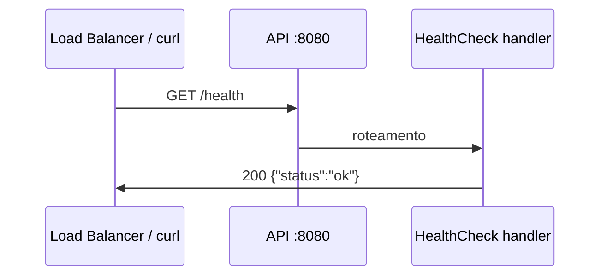

# CHANGE LOG — Health Check Endpoint (2026-06-12)

## Resumo

Adição do endpoint **`GET /health`** para verificação de liveness da API, com teste unitário e documentação de decisões.

---

## O que mudou

### Novo endpoint

```
GET /health → 200 {"status":"ok"}
```

- Confirma que o processo HTTP está ativo
- **Não** consulta o ViaCEP (liveness, não readiness)
- Resposta JSON alinhada ao padrão da API

### Arquivos criados

| Arquivo | Descrição |
|---------|-----------|
| `internal/handler/health.go` | Handler `HealthCheck` e struct `healthResponse` |
| `internal/handler/health_test.go` | Teste unitário do endpoint |
| `specs/STATE_2026-06-12-health-check.md` | Decisões de design do health check |

### Arquivos alterados

| Arquivo | Alteração |
|---------|-----------|
| `internal/handler/cep.go` | Registro de `GET /health` em `NewRouter` |

---

## Fluxo



---

## Como testar

### Teste unitário

```bash
go test ./internal/handler/... -v -run Health
```

### Manual (API rodando)

```bash
go run ./cmd/server

curl -s http://localhost:8080/health
# {"status":"ok"}
```

### CI

O workflow `.github/workflows/ci.yml` já executa `go test ./...` — o novo teste entra automaticamente no pipeline.

---

## Decisões em uma linha

| Decisão | Escolha |
|---------|---------|
| Path | `/health` |
| Tipo | Liveness (sem ViaCEP) |
| Formato | JSON `{"status":"ok"}` |
| Camadas | Apenas handler (sem service) |

Detalhes completos: [`specs/STATE_2026-06-12-health-check.md`](../specs/STATE_2026-06-12-health-check.md)

---

## Relacionado

- Changelog da implementação inicial: [`CHANGE_LOG_2026-06-12.md`](CHANGE_LOG_2026-06-12.md)
