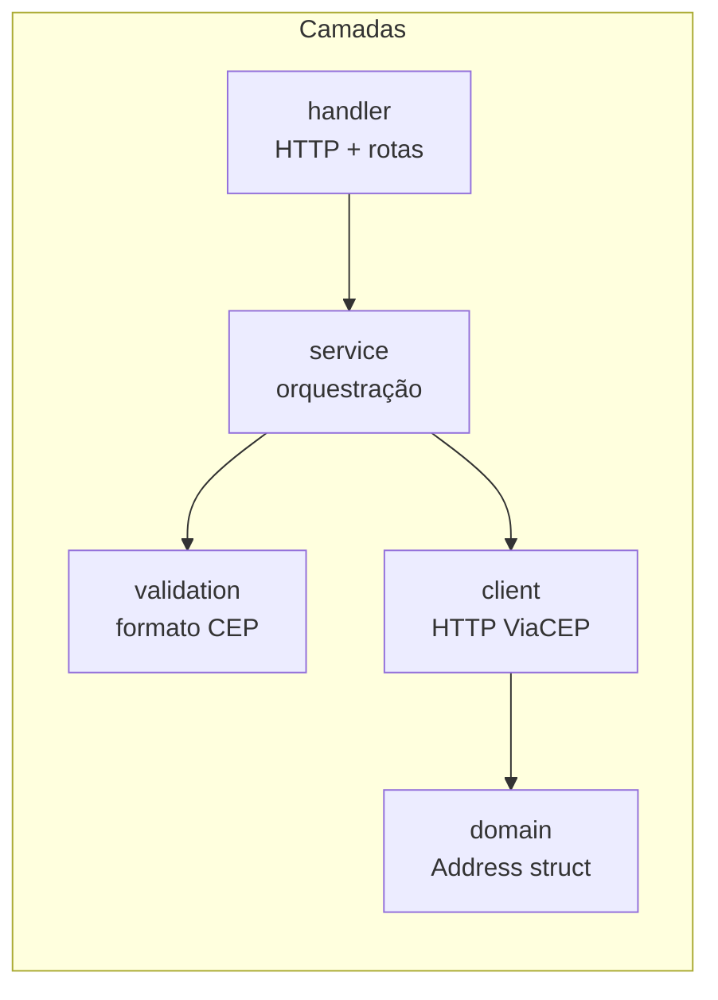
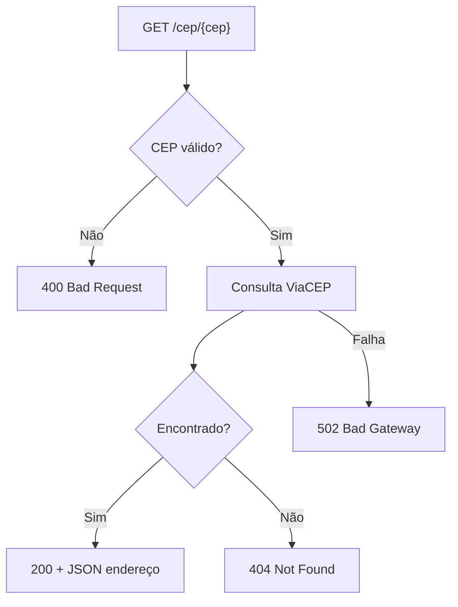
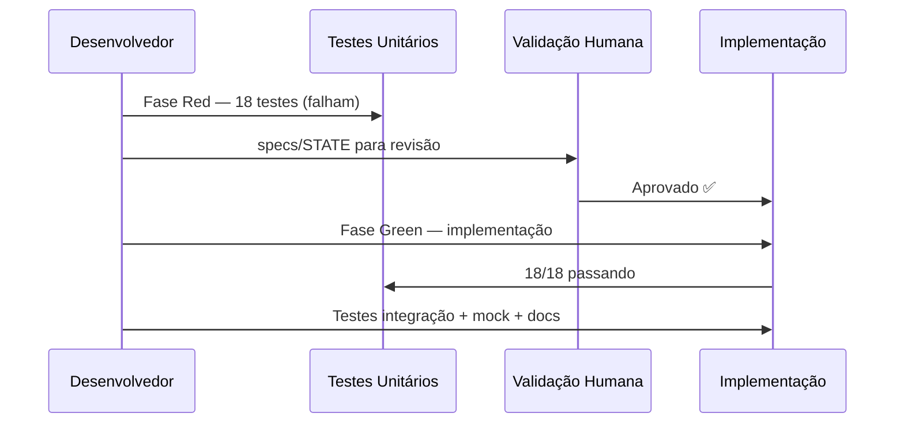

# CHANGE LOG — 2026-06-12

## Resumo

Implementação completa da **API CEP** — proxy REST em Go para o webservice [ViaCEP](https://viacep.com.br/). Desenvolvida em TDD com validação humana entre as fases Red e Green.

---

## O que foi entregue

### API REST

- Endpoint `GET /cep/{cep}` recebe CEP sem hífen (8 dígitos)
- Consulta o ViaCEP, mapeia JSON → struct Go → JSON de resposta
- Mesmo contrato JSON do ViaCEP na resposta de sucesso

### Arquitetura em camadas



| Camada | Pacote | Arquivo | Responsabilidade |
|--------|--------|---------|------------------|
| Handler | `internal/handler` | `cep.go` | Rotas, status HTTP, serialização |
| Service | `internal/service` | `cep.go` | Validação + delegação ao client |
| Client | `internal/client` | `viacep.go` | Requisição HTTP ao ViaCEP |
| Domain | `internal/domain` | `address.go` | Struct `Address`, `ErrNotFound` |
| Validation | `internal/validation` | `cep.go` | Regra dos 8 dígitos numéricos |

### Mapeamento de erros HTTP



### Testes

| Tipo | Quantidade | Localização |
|------|------------|-------------|
| Unitários | 18 casos | `internal/*_test.go` |
| Integração (handler) | 2 casos | `internal/handler/cep_integration_test.go` |
| E2E | 3 casos | `test/integration/api_test.go` (tag `integration`) |

**Cobertura por camada:**

- `validation` — formato do CEP (válido, tamanho, caracteres)
- `domain` — serialização/deserialização JSON, flag `erro`
- `client` — sucesso, not found, 400, 5xx (com `httptest`)
- `service` — orquestração com mocks
- `handler` — status HTTP 200/400/404/502

### Mock local

- Servidor mock em `mocks/mockserver/` simula o ViaCEP
- Respostas JSON em `mocks/responses/{cep}.json`
- Configurável via `VIACEP_BASE_URL=http://localhost:8081`

### Documentação

- `README.md` — como executar, testar e usar o mock
- `specs/STATE_2026-06-12.md` — decisões de arquitetura
- Código de produção com comentários linha a linha

---

## Fluxo de desenvolvimento (TDD)



---

## Como executar

### 1. Subir mock + API

```bash
# Terminal 1
go run ./mocks/mockserver

# Terminal 2
VIACEP_BASE_URL=http://localhost:8081 go run ./cmd/server
```

### 2. Testar manualmente

```bash
curl http://localhost:8080/cep/01001000
curl http://localhost:8080/cep/99999999
curl http://localhost:8080/cep/95010A10
```

### 3. Rodar testes

```bash
# Unitários + integração handler
go test ./... -v

# E2E (requer API rodando)
go test -tags=integration ./test/integration/... -v
```

---

## Decisões técnicas registradas

1. **`net/http` puro** — sem framework, para fins didáticos
2. **Injeção de dependência** — interfaces em handler e service para testabilidade
3. **404 para CEP inexistente** — mais semântico que repassar `{"erro":"true"}`
4. **502 para falha upstream** — API atua como proxy
5. **Validação dupla** — handler e service validam CEP (defesa em profundidade)
6. **Tag `integration`** — separa testes E2E dos unitários no CI

---

## CI (GitHub Actions)

Workflow em `.github/workflows/ci.yml`:

- Dispara em `push` e `pull_request` na branch `main`
- Usa `actions/setup-go@v5` com `go-version-file: go.mod` (Go 1.23)
- Executa `go build ./...` e `go test -race ./...`
- Testes E2E (`test/integration`, tag `integration`) ficam fora do CI — exigem API em execução

## Próximos passos sugeridos

- [ ] Dockerfile e docker-compose (API + mock)
- [ ] Middleware de logging e métricas
- [ ] Cache em memória para CEPs consultados
- [x] CI com GitHub Actions (`go test ./...`)
