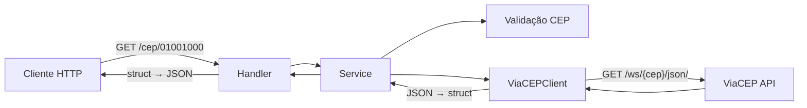

# STATE — API CEP (ViaCEP Proxy)

**Data:** 2026-06-12  
**Status:** 🟢 Implementado (Fase TDD — Green)  
**Validação humana:** Aprovada em 2026-06-12

---

## 1. Objetivo

Criar uma API REST em Go que:

1. Recebe um CEP **sem hífen** via path: `GET /cep/{cep}`
2. Consulta o webservice [ViaCEP](https://viacep.com.br/) em JSON
3. Mapeia a resposta em uma `struct` Go
4. Serializa e retorna o **mesmo contrato JSON** do ViaCEP

---

## 2. Arquitetura proposta



### Camadas

| Camada | Pacote | Responsabilidade |
|--------|--------|------------------|
| Handler | `internal/handler` | HTTP, roteamento, status codes |
| Service | `internal/service` | Orquestração e regras de negócio |
| Client | `internal/client` | Comunicação HTTP com ViaCEP |
| Domain | `internal/domain` | Struct `Address` e erros de domínio |
| Validation | `internal/validation` | Validação de formato do CEP |

### Princípios aplicados

- **Separation of Concerns:** cada camada tem uma responsabilidade única
- **Dependency Injection:** client e service recebem dependências via construtor (facilita testes)
- **Interface segregation:** `CEPService` e `ViaCEPClient` como interfaces para mocks
- **Fail fast:** CEP inválido é rejeitado antes de chamar o ViaCEP

---

## 3. Contrato da API

### Request

```
GET /cep/{cep}
```

- `{cep}`: 8 dígitos numéricos, sem hífen (ex: `01001000`)

### Response — Sucesso (200)

```json
{
  "cep": "01001-000",
  "logradouro": "Praça da Sé",
  "complemento": "lado ímpar",
  "unidade": "",
  "bairro": "Sé",
  "localidade": "São Paulo",
  "uf": "SP",
  "estado": "São Paulo",
  "regiao": "Sudeste",
  "ibge": "3550308",
  "gia": "1004",
  "ddd": "11",
  "siafi": "7107"
}
```

### Response — Erros

| Cenário | HTTP Status | Condição |
|---------|-------------|----------|
| CEP formato inválido | 400 | Menos/mais de 8 dígitos, alfanumérico, hífen, espaço |
| CEP inexistente | 404 | ViaCEP retorna `{"erro": "true"}` |
| Falha no upstream | 502 | ViaCEP indisponível ou erro 5xx |

---

## 4. Struct de domínio

```go
type Address struct {
    CEP         string `json:"cep"`
    Logradouro  string `json:"logradouro"`
    Complemento string `json:"complemento"`
    Unidade     string `json:"unidade"`
    Bairro      string `json:"bairro"`
    Localidade  string `json:"localidade"`
    UF          string `json:"uf"`
    Estado      string `json:"estado"`
    Regiao      string `json:"regiao"`
    IBGE        string `json:"ibge"`
    GIA         string `json:"gia"`
    DDD         string `json:"ddd"`
    SIAFI       string `json:"siafi"`
    Erro        string `json:"erro,omitempty"`
}
```

**Decisão:** campo `Erro` com tag `omitempty` para detectar CEP inexistente sem expor na resposta de sucesso.

---

## 5. Mapeamento de erros HTTP

| Erro interno | HTTP | Justificativa |
|--------------|------|---------------|
| `validation.ErrInvalidCEP` | 400 | Alinhado com ViaCEP (400 para formato inválido) |
| `domain.ErrNotFound` | 404 | CEP válido mas inexistente |
| Outros erros | 502 | Proxy não conseguiu obter resposta do upstream |

---

## 6. Testes — Fase TDD (Red)

### Testes unitários criados (aguardando implementação)

| Arquivo | Casos de teste |
|---------|----------------|
| `internal/validation/cep_test.go` | CEP válido, tamanho inválido, caracteres inválidos |
| `internal/domain/address_test.go` | Serialização JSON, deserialização, flag de erro |
| `internal/client/viacep_test.go` | Sucesso, not found, bad request, upstream error |
| `internal/service/cep_test.go` | Sucesso, CEP inválido, not found, falha upstream |
| `internal/handler/cep_test.go` | 200, 400, 404, 502 |

### Testes de integração (planejados — Fase Green+)

| Arquivo | Escopo |
|---------|--------|
| `internal/handler/cep_integration_test.go` | Handler + Service + Client com mock server |
| `test/integration/api_test.go` | API completa com mock ViaCEP embutido |

**Tag de build:** `//go:build integration` para separar testes de integração.

---

## 7. Mock local (planejado)

```
mocks/
├── responses/
│   ├── 01001000.json      # CEP válido — Praça da Sé
│   └── 99999999.json      # CEP inexistente
└── mockserver/
    └── main.go            # Servidor mock do ViaCEP
```

**Variável de ambiente:** `VIACEP_BASE_URL=http://localhost:8081` para apontar ao mock.

---

## 8. Estrutura de diretórios final

```
api-cep/
├── cmd/
│   └── server/
│       └── main.go
├── internal/
│   ├── domain/
│   ├── validation/
│   ├── client/
│   ├── service/
│   └── handler/
├── mocks/
├── specs/
│   └── STATE_2026-06-12.md
├── changelogs/
│   └── CHANGE_LOG_2026-06-12.md
├── test/
│   └── integration/
├── go.mod
└── README.md
```

---

## 9. Decisões pendentes de validação

| # | Decisão | Alternativa considerada |
|---|---------|------------------------|
| 1 | Path `/cep/{cep}` | `/ws/{cep}/json/` (espelharia ViaCEP) — rejeitado por ser menos RESTful |
| 2 | 404 para CEP inexistente | 200 com `{"erro":"true"}` — rejeitado; API deve ser mais semântica |
| 3 | 502 para falha upstream | 503 — 502 escolhido por ser proxy |
| 4 | `net/http` puro | Framework (Gin, Echo) — rejeitado para fins didáticos |
| 5 | Comentários linha a linha no código de produção | Apenas em código de produção, não nos testes |

---

## 10. Checklist de validação humana

- [x] Contrato da API (`GET /cep/{cep}`) está correto?
- [x] Mapeamento de status HTTP (400/404/502) está adequado?
- [x] Struct `Address` cobre todos os campos do ViaCEP?
- [x] Cobertura de testes unitários é suficiente?
- [x] Arquitetura em camadas faz sentido para estudo?
- [x] Abordagem de mock local é clara?

**Implementação concluída:** Fase Green, testes de integração, mock server, README e CHANGELOG entregues.
